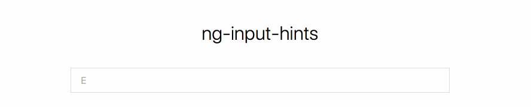

*Animates input placeholders to make it look like they are being typed in realtime.*

## Install

```bash
$ npm install ng2-input-hints
# or
$ yarn add ng2-input-hints
```

## Usage

Import the `InputHintsModule` and include it in your NgModule:

```js
import { InputHintsModule } from 'ng2-input-hints'
```

```html
<input [inputHints]="['Lorem ipsum', 'dolor sit amet', 'consectetur adipiscing elit']"
       [inputHintsWaitBeforeDeleteMs]="9000"
       [inputHintsWriteSpeedMs]="100"
       [inputHintsDeleteSpeedMs]="60"
/>
```

## Tips

Use the [`selector:placeholder`](http://css-tricks.com/snippets/css/style-placeholder-text/) CSS pseudo-class to style your placeholders!

## License

Licensed under the MIT license.

## Authors

**William Boman** <william@redwill.se>
